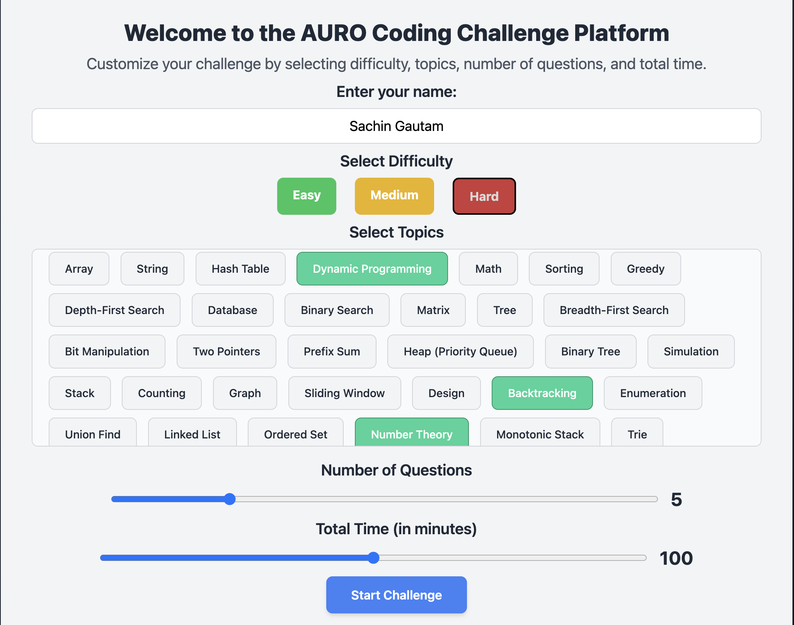

# AI-Powered Coding Platform
**Site is live**  [AI Coding Platform]([https://ai-coding-platform.onrender.com])

### Welcome to the AI-Powered Coding Platform, an innovative solution designed to enhance coding skills and problem-solving abilities. This platform combines the power of AI and real-time code evaluation to provide an engaging and educational experience for users.

 
---

## Features 🚀

  **Dynamic Challenges** 🎯
   - Customizable Topics & Difficulty Levels: Choose from a wide range of topics and difficulty levels tailored to your skill set.
   - AI-Generated Questions: Leverage AI to create unique and relevant problems based on user preferences.

  **Real-Time Code Execution** 💻 
   - Language Support: Submit solutions in popular programming languages such as Python, C++, Java, and C.
   - Output Validation: Validate your solutions in real-time using the integrated **JDoodle API**.

  **AI-Generated Feedback** 🔍
   - Comprehensive Evaluations Get insights on correctness, efficiency, and coding style.
   - Solution Suggestions: For incorrect or empty submissions, the AI provides detailed solutions with explanations.

  **Timer & Progress Tracking** 🕒 
   - Time Management: Solve challenges with a real-time timer to track performance.
   - Session-Based Progress: Resume challenges and maintain a continuous learning flow.

  **Leaderboard** 🏆
   - Competitive Edge: Compare your performance with others on a leaderboard.
   - Score Calculation: Dynamic scoring system based on the number of correctly solved challenges.

---

## Tech Stack 🛠 
**Backend**
- Flask: Handles the server-side logic and user management.
- Google Generative AI: Powers the dynamic question generation and AI feedback.

**Frontend**
- HTML5, CSS3, JavaScript: Build responsive and interactive UI components.
- TailwindCSS: Modern utility-first CSS framework for a sleek design.

**Integrations**
- JDoodle API: Executes user code in real-time and validates outputs.
- dotenv: Manages environment variables for secure configuration.

---

## Screenshots 🎨
  **Home Page**
- Select difficulty, topics, and number of questions.
- Customize the time limit for your coding session.
  
   

 **Coding Challenge Interface**
- Split-pane view for problem description and code editor.
- Resizable panes with syntax highlighting and multiple language support.

   

 **Feedback Page**
- AI-generated feedback on submitted solutions.
- High-contrast result boxes for enhanced readability.

  

  
  
   

 **Leaderboard**
- See your performance compared to other participants.
- Scores displayed up to two decimal points.

   

---

## Getting Started 🚀 

  **Prerequisites**
- Python 3.7 or above installed.
- Google Gemini API key for dynamic question generation and AI integration for solution.
- JDoodle client credentials for code execution.

 **Installation**

1. Clone the Repository:
   ```bash
   git clone https://github.com/StartrekI/ai-coding-platform.git
   cd ai-coding-platform
  
2. Install Dependencies:
   ```bash
   pip install -r requirements.txt
   
3. Run the Application:
   ```bash
   python app.py
   
4. Access the Platform: Open http://127.0.0.1:5000 in your web browser.


  
